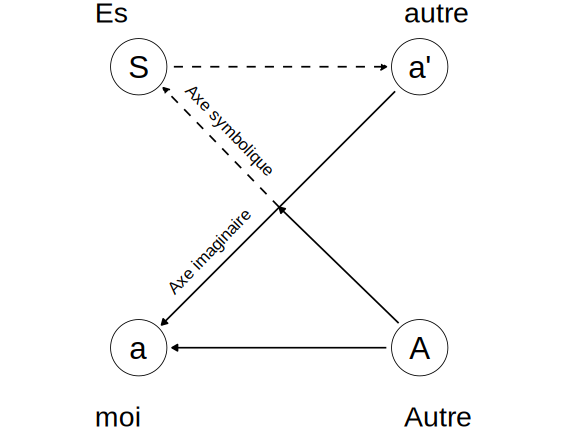

```{r}
#| echo: false
library(ggplot2)
# library(grid)
library(svglite)

# -----------------------------
# Données : positions des points
# -----------------------------
pts <- data.frame(
  id    = c("S", "a'", "a", "A"),
  x     = c(1, 9, 1, 9),
  y     = c(9, 9, 1, 1),
  label = c("S", "a'", "a", "A")
)

# -----------------------------
# Construction du graphique
# -----------------------------
p <- ggplot() +
  # Cercles
  geom_point(
    data = pts,
    aes(x, y),
    shape = 21,
    size = 26,
    fill = "white",
    colour = "black",
    stroke = 0.6
  ) +

  # Lettres dans les cercles
  geom_text(
    data = pts,
    aes(x, y, label = label),
    size = 11,
    family = "sans"
  ) +

  # S -----> a'  (ligne horizontale pointillée)
  geom_segment(
    aes(x = 2, y = 9, xend = 8.05, yend = 9),
    linewidth = 0.8,
    linetype = "dashed",
    arrow = arrow(length = unit(0.22, "cm"), type = "closed")
  ) +

  # a' -----> a  (axe imaginaire)
  geom_segment(
    aes(x = 8.3, y = 8.3, xend = 1.65, yend = 1.65),
    linewidth = 0.8,
    arrow = arrow(length = unit(0.22, "cm"), type = "closed")
  ) +

  # A -----> S (diagonale montante pleine)
  geom_segment(
    aes(x = 8.4, y = 1.7, xend = 5, yend = 5),
    linewidth = 0.8,
    arrow = arrow(length = unit(0.22, "cm"), type = "closed")
  ) +
  
  # A -----> S (diagonale montante pointillée)
  geom_segment(
    aes(x = 5, y = 5, xend = 1.7, yend = 8.4),
    linewidth = 0.8,
    linetype = "dashed",
    arrow = arrow(length = unit(0.22, "cm"), type = "closed")
  ) +
  
  # A -----> a (ligne horizontale basse)
  geom_segment(
    aes(x = 8.05, y = 1, xend = 1.95, yend = 1),
    linewidth = 0.8,
    arrow = arrow(length = unit(0.22, "cm"), type = "closed")
  ) +

  # Libellés des axes
  annotate(
    "text",
    x = 3.6, y = 7.2,
    label = "Axe symbolique",
    angle = -46,
    size = 6
  ) +
  annotate(
    "text",
    x = 3, y = 3.75,
    label = "Axe imaginaire",
    angle = 46,
    size = 6
  ) +

  # Libellés extérieurs
  annotate("text", x = -0.25, y = 10.55, label = "Es", size = 10, hjust = 0) +
  annotate("text", x = 8.55, y = 10.55, label = "autre", size = 10, hjust = 0) +
  annotate("text", x = -0.25, y = -0.95, label = "moi", size = 10, hjust = 0) +
  annotate("text", x = 8.55, y = -0.95, label = "Autre", size = 10, hjust = 0) +

  coord_equal(xlim = c(-0.5, 11), ylim = c(-1.4, 10.9), expand = FALSE) +
  theme_void() +
  theme(
    plot.background  = element_rect(fill = "white", colour = NA),
    panel.background = element_rect(fill = "white", colour = NA)
  )


# -----------------------------
# Export SVG
# -----------------------------
ggsave(
  filename = "schema_lacan.svg",
  plot = p,
  device = svglite,
  width = 8,
  height = 6,
  units = "in"
)
```

# L'intelligence artificielle et la rédaction d'articles de blog

A l'ère des intelligences artificielles (IA) génératives qui conquièrent la plupart (voire tous) les champs de la création, nous oscillons bien souvent entre enthousiasme et angoisse. Cette angoisse est celle d'être privé de cette part de nous-même que d'aucuns présentent comme le socle de notre humanité et de notre subjectivité. Que nous resterait-il si ce socle venait à disparaître ? J'ai récemment apprécié la lecture du texte de @leclaire2024wordpressIA qui rapporte une innovation majeure proposée par la plateforme de blogging [Wordpress](https://wordpress.com/fr/) : l'utilisation de l'IA afin de générer un article à partir d'une simple idée de départ, le reste étant pris en charge par l'algorithme. Il pointe là une étape décisive en rupture avec l'idéal initial du blogging (exprimer une opinion personnelle sans qu'elle ne soit nécessairement parfaitement présentée) au profit d'une efficacité et d'un rendement accrus. Selon @leclaire2024wordpressIA, cette étape mène à une situation absurde :

> Pensons-y une seconde. Vous utilisez une IA pour écrire votre contenu. Vos lecteurs utilisent une IA pour résumer ce contenu. Les moteurs de recherche utilisent une IA pour l’indexer. Les publicités sont ciblées par une IA. \[...\]
>
> Des robots qui écrivent pour des robots qui lisent pour des robots qui agrègent.

Pour ma part, j'ai récemment connecté le logiciel avec lequel j'écris ([RStudio](https://posit.co/)) à [Github Copilot](https://github.com/features/copilot). Cette IA spécifique aux utilisateurs de Github consulte en temps réel le texte ou le code que j'écris afin de proposer de les compléter. A l'heure où j'écris ces lignes, Github Copilot me propose de temps à autre de terminer ma phrase ou une phrase suivante qui pourrait convenir. Il me suffit alors d'appuyer sur la touche TAB de mon clavier pour qu'elle s'écrive alors automatiquement. Dans la plupart des cas, j'estime les propositions inadéquates voire tout à fait fausses. Mais il m'arrive de valider certaines propositions qui me paraissent pertinentes. Cet accompagnement de mon écriture m'a évoqué un souvenir d'enfance.

# Un souvenir d'enfance

J'ai grandi dans un village au sud de Bruxelles, fréquenté une école primaire à taille humaine, entouré par une famille aimante et bienveillante. Ma famille était très investie dans mon éducation et veillait à ce que je ne manque de rien. Durant mon enfance, elle me conduisait constamment en voiture et il m'arrivait de me rendre au magasin avec elle afin d'y faire des courses. Au détour des allées des magasins, il pouvait arriver que nous croisions des personnes que nous connaissions. C'était en fait assez fréquent. La conversation s'engageait alors immanquable, conversation au cours de laquelle les adultes prenaient des nouvelles les uns des autres. Quelques minutes plus tard, les regards se tournaient alors souvent vers moi, comme pour s'enquérir de mes nouvelles. Il pouvait m'arriver d'oser dire que j'allais bien. Mais très rapidement, ma famille renchérissait afin de développer mes récentes activités, mésaventures ou hauts-faits scolaires. La conversation pouvait durer plusieurs minutes sans que je n'ouvre à nouveau le bouche jusqu'au moment de dire au revoir.

Ces épisodes étaient fréquents et me semblaient bienveillants, valorisants et somme toute banals. L'enfant que j'étais à l'époque ne pouvait toutefois que trouver étrange qu'une conversation dont il était l'objet ne nécessitât qu'il ouvrît la bouche.

# Retour au schéma L de Jacques Lacan

Lorsque j'avais vingt ans, je fréquentais un séminaire d'introduction aux concepts fondamentaux de la psychanalyse à l'Association Freudienne de Belgique. Ses membres y étaient étonnement plus lacaniens que freudiens mais cela me permit de découvrir les théorisations de Jacques Lacan. Vers 22 ans, j'entamai un travail psychothérapeutique d'influence analytique. Mon chemin professionnel m'éloigna toutefois progressivement des concepts lacaniens alors que les facultés de psychologie des universités belges invitèrent ceux qui les portaient à prendre leur retraite. Aujourd'hui, la psychanalyse occupe une place plus marginal de le champs des praticiens de la santé mentale belge qu'il y a trente ans.

La lecture du texte de @leclaire2024wordpressIA semble toutefois avoir provoqué un *retour du refoulé* chez moi : un concept lacanien s'imposa à moi sans que je n'en comprenne d'emblée le sens. C'est le *schéma L* (parfois appelé Z) tel que @lacan1966schemaL le présente dans ses Ecrits et puis dans un séminaire ultérieur [@lacan1978seminaire2]. La @fig-schemalacan représente ce schéma L.

{#fig-schemalacan}

Il me serait trop ambitieux de le décrire avec l'exhaustivité des érudits lacaniens. Je me contenterai dès lors de dire ce que j'en avais retenu, au risque d'imprécisions et d'approximations[^1].

[^1]: Les lacaniens ont parfois tendance à reprocher à tout commentateur des textes de Lacan de les avoir mécompris.

-   La lettre **S** représente le Sujet, c'est-à-dire cette part de nous-même qui est *inconsciente* mais qui nous fonde en tant que *personne unique* ;

-   **a'** est la réponse des autres personnes qui nous entourent et qui nous renvoient une image de nous-mêmes (par exemple, une mère qui dit à sa fille : *"tu es laide"* ou *"tu es la plus belle"*) ;

-   **a** est l'introjection de ces images qui mène à la création du *moi*, c'est-à-dire une *construction mentale à laquelle nous adhérons* et nous permet de répondre à la question *"qui suis-je ?"* lorsque des autres nous la posent ;

-   La lettre **A** représente le *grand Autre*, c'est-à-dire un lieu qui contient les signifiants culturels dans lequel nous évoluons.

## L'axe imaginaire

Selon Lacan, la dynamique principalement à l’œuvre dans la *conscience* des individus est celle qui se situe sur l'*axe imaginaire* : nous interagissons presque constamment avec des autres qui nous renvoient une image plus ou moins déformée de ce qu'ils pensent percevoir de nous. Simultanément nous interprétons plus ou moins bien ces images, dont nous nous nourrissons pour espérer répondre à la question de notre *identité*. Mais il s'agit de l'axe des faux-semblants car il repose constamment sur des appréciations erronées, tant de la part de nous-mêmes que des autres. Il existe à ce titre une *aliénation* : nous sommes constamment contaminés par les images que les autres nous renvoient car elles nourrissent notre identité. Le *paradoxe* est majeur : nous sommes attentifs aux autres pour espérer savoir qui nous sommes mais, par là-même, nous nous construisons un moi qui s'éloigne de notre subjectivité.

Lorsque vous pensez aimer une personne, vous êtes sur l'axe imaginaire. Lorsque vous pensez détester une personne, vous êtes sur l'axe imaginaire. Lorsque ma famille parle de moi à ses connaissances, nous sommes sur l'axe imaginaire. Lorsque vous postez une image sur les réseaux sociaux et que des personnes like votre photo, vous êtes sur l'axe imaginaire. Lorsque vous consultez un coach qui vous aide à être davantage efficace au travail, vous êtes sur l'axe imaginaire. Etc.

Cet axe se rapproche des systèmes *Conscient* (Cs) et *Préconscient* (Pcs) définis par @freud1900interpretation. Ils rassemblent ce que nous pensons savoir de nous-mêmes, avec plus ou moins de conviction.

## L'axe symbolique

L'axe symbolique est celui qui relie le Sujet au grand Autre, c'est-à-dire à la culture (au sens large) dans laquelle nous évoluons. C'est l'axe de la loi, de la morale, de la religion, de la politique, etc. C'est aussi l'axe du *langage* : les mots que nous utilisons pour nous exprimer sont des signifiants qui font partie du grand Autre. Lorsque nous parlons, nous sommes sur l'axe symbolique. Mais la portée profonde des mots et des signifiants nous échappent car ils nous pré-existent et nous survivront. L'accès du Sujet au grand Autre est *entravé par l'axe imaginaire* car les croyances conscientes font obstacle à la recherche des causes plus anciennes et profondes. Par exemple, nous pouvons croire que telle personne gâche notre vie, ce qui est susceptible de provoquer de la haine à son égard. Or, cette croyance et cette colère font obstacle aux causes originelles (par exemple, un parent qui aurait interdit à son enfant de réaliser une chose importante à ses yeux). La thérapie analytique vise à faire émerger ces causes profondes en contournant les croyances conscientes et les émotions qui y sont associées. Elle vise à *intensifier le recours à l'axe symbolique* et à déconstruire les certitudes apparentes de l'axe imaginaire.

## Le travail de subjectivation

Notez que pour @lacan1966schemaL, il n'existe pas de connexion directe entre le Sujet (S) et son moi (a). L'accès au sujet n'est possible que par le grand Autre, c'est-à-dire à travers une personne qui est susceptible d'en être le garant. Pour Lacan, il s'agit du personnage du *psychanalyste* qui pose le postulat de départ qu'*il existe un Inconscient* (Ics). Lorsqu'un patient en analyse affirme *"Je déteste mon patron !"*, le psychanalyste pose l'hypothèse que le patient déteste inconsciemment une autre personne (par exemple son père qui lui aurait causé du tort). L'objet de la thérapie n'est donc pas le patron mais bien un autre personnage, en l’occurrence le père, qui est maintenu dans une zone oubliée de la mémoire du patient. Le travail analytique nécessite dès lors de dépasser les apparences trompeuses.

# Le risque de notre aliénation aux IA génératives

Mais quel est donc le rapport entre les blogs, l'IA, ma famille et le schéma L ?

Dans son texte, @leclaire2024wordpressIA utilise le terme de *cauchemar* car les IA qui interagissent mutuellement construisent un sens factice qui s'impose à nous. Lorsque Github Copilot me propose des phrases que je n'ai pas écrites, je revoie l'enfant qui écoutait les adultes parler de lui sans qu'il ne doive ouvrir la bouche. Les textes générés par l'IA s'imposent à nous et nous aliènent dans un système clos duquel notre subjectivité est évincée. Nous sommes *subjectivement exclus* de notre propre texte. Cela ravive le vécu qui accompagne les nombreuses situations - que chacun de nous a probalement connues - au cours desquelles nous sommes physiquement présents mais symboliquement invisibles. Pensez à des réunions ou des fêtes de famille auxquelles vous avez participé sans que personne ne s'intéresse jamais à vous. La *dissolution du sujet* n'est pas rare dans les situations sociales. Elle s'accompagne toutefois souvent de sentiments diffus de non-existence inconfortables et parfois insupportables. Le risque de l'utilisation banalisée des IA génératives est de *surinvestir l'axe imaginaire* *au détriment de l'axe symbolique*. Or, il s'agit de l'axe de l'*aliénation*, c'est-à-dire de l'axe qui *survalorise une construction trompeuse de nous-même* au détriment de notre histoire personnelle et subjective. Le risque est de nous retrouver prisonniers de cet axe imaginaire sans y trouver la moindre porte de sortie.